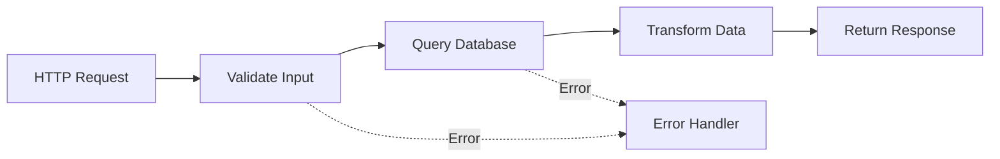
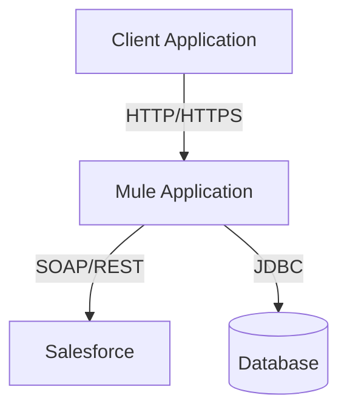

# MuleSoft Project Documentation Skill

## Purpose
This skill enables Claude to generate comprehensive, professional documentation for MuleSoft integration projects. It analyzes Mule project structures, flows, connectors, and configurations to create detailed technical documentation.

## When to Use This Skill
Use this skill when:
- Creating documentation for a new MuleSoft project
- Updating existing project documentation
- Generating API documentation for Mule applications
- Documenting integration flows and data transformations
- Creating deployment guides
- Documenting connector configurations
- Generating architecture diagrams in text/markdown format

## Prerequisites
- Access to the MuleSoft project directory
- Project XML files (mule-config.xml, pom.xml, etc.)
- API specifications (RAML/OAS) if applicable

## Documentation Components

### 1. Project Overview Section
Generate a high-level overview including:
- **Project Name**: Extract from pom.xml or project structure
- **Purpose**: Describe the integration's business purpose
- **Version**: Current version from pom.xml
- **Mule Runtime Version**: Extract from mule-artifact.json or pom.xml
- **Key Features**: List main capabilities

### 2. Architecture Documentation

#### Flow Documentation
For each flow in the project, document:
- **Flow Name**: Extract from XML `name` attribute
- **Trigger Type**: HTTP listener, Scheduler, Queue consumer, etc.
- **Processing Steps**: List all processors in order
- **Error Handling**: Document error handlers and retry logic
- **Data Transformations**: DataWeave scripts and transformations

Example format:
```markdown
### Flow: retrieve-customer-api

**Type**: HTTP Listener
**Path**: /api/customers/{customerId}
**Method**: GET

**Processing Steps**:
1. Validate request parameters
2. Query Salesforce for customer data
3. Transform response using DataWeave
4. Return JSON response

**Error Handling**:
- HTTP 404 for customer not found
- HTTP 500 for system errors
```

#### Connector Documentation
For each connector used:
- **Connector Type**: (Salesforce, Database, HTTP, etc.)
- **Configuration Name**: From connector config
- **Connection Details**: Host, port, credentials reference
- **Operations Used**: List all operations/methods used

### 3. API Documentation (if applicable)

For HTTP-based APIs, document:
- **Base Path**: Root URL path
- **Endpoints**: All available endpoints
- **Request/Response Formats**: Expected payloads
- **Authentication**: Security schemes used
- **Error Codes**: HTTP status codes and meanings

### 4. Configuration Documentation

Document all global configurations:
- **Global Properties**: From properties files
- **Environment Variables**: Required env vars
- **Connector Configs**: Database, API connections
- **Security Configs**: TLS, OAuth, API keys

### 5. Data Model Documentation

Document data structures:
- **Input Schemas**: Expected request formats
- **Output Schemas**: Response formats
- **Transformations**: DataWeave mappings
- **Database Schemas**: If using DB connector

### 6. Deployment Documentation

Include deployment information:
- **Target Platform**: CloudHub 2.0, Runtime Fabric, On-Premise
- **Resource Requirements**: vCores, memory
- **Environment Configuration**: Dev, Test, Prod settings
- **Prerequisites**: Dependencies, external services
- **Deployment Steps**: Step-by-step deployment guide

### 7. Error Handling & Logging

Document error strategies:
- **Error Types**: List custom and standard errors
- **Error Handlers**: On-Error-Continue vs On-Error-Propagate
- **Logging Strategy**: What gets logged and at what level
- **Monitoring**: Key metrics and alerts

## Analysis Process

### Step 1: Project Discovery
```bash
# Find all Mule configuration files
find <project-path> -name "*.xml" -path "*/src/main/mule/*"

# Find pom.xml
find <project-path> -name "pom.xml" -maxdepth 2

# Find properties files
find <project-path> -name "*.properties" -o -name "*.yaml"
```

### Step 2: Parse XML Configurations
Extract key information from XML files:
- Flow definitions (`<flow>` tags)
- Sub-flows (`<sub-flow>` tags)
- Global configurations (`<configuration>` tags)
- Connector configs (`<salesforce:config>`, `<db:config>`, etc.)
- HTTP listener configs
- Error handlers

### Step 3: Parse POM.xml
Extract from pom.xml:
```xml
<groupId>
<artifactId>
<version>
<dependencies> - all MuleSoft connectors and dependencies
<properties> - Mule runtime version
```

### Step 4: Analyze DataWeave Scripts
Look for DataWeave transformations:
- In `<ee:transform>` elements
- In separate .dwl files
- Document input/output mappings

### Step 5: Generate Documentation Structure

Create a markdown document with this structure:
```markdown
# [Project Name] - Technical Documentation

## Table of Contents
1. Project Overview
2. Architecture Overview
3. API Specifications
4. Flow Documentation
5. Connector Configurations
6. Data Transformations
7. Error Handling
8. Deployment Guide
9. Testing Guide
10. Appendix

## 1. Project Overview
[Content]

## 2. Architecture Overview
### System Architecture
[High-level description]

### Integration Flows
[Flow diagram in text/markdown]

## 3. API Specifications
[API endpoints and operations]

## 4. Flow Documentation
### Flow: [name]
[Detailed flow documentation]

## 5. Connector Configurations
### [Connector Name]
[Configuration details]

## 6. Data Transformations
### Transformation: [name]
[DataWeave logic and mappings]

## 7. Error Handling
[Error handling strategy]

## 8. Deployment Guide
[Step-by-step deployment]

## 9. Testing Guide
[Testing approach and test cases]

## 10. Appendix
[Additional resources]
```

## XML Parsing Guidelines

### Identify Flow Components
```xml
<flow name="main-flow">
  <http:listener config-ref="HTTP_Listener_config" path="/api/endpoint"/>
  <logger level="INFO" message="Processing request"/>
  <salesforce:query config-ref="Salesforce_Config">
    <salesforce:salesforce-query>SELECT Id, Name FROM Account</salesforce:salesforce-query>
  </salesforce:query>
  <ee:transform>
    <ee:message>
      <ee:set-payload><![CDATA[%dw 2.0
output application/json
---
payload map {
  id: $.Id,
  name: $.Name
}]]></ee:set-payload>
    </ee:message>
  </ee:transform>
</flow>
```

Document as:
- Flow triggered by HTTP listener on /api/endpoint
- Logs incoming request
- Queries Salesforce for Account records
- Transforms data to JSON format

### Extract Connector Configurations
```xml
<salesforce:sfdc-config name="Salesforce_Config">
  <salesforce:basic-connection 
    username="${salesforce.username}" 
    password="${salesforce.password}" 
    securityToken="${salesforce.token}"/>
</salesforce:sfdc-config>
```

Document connection parameters and property references.

## Output Format

### Primary Output: Markdown Document
Create a comprehensive `.md` file with:
- Clear section headers
- Code blocks for configurations
- Tables for structured data
- Inline code for property names
- Links between sections

### Optional Outputs
- **Architecture Diagram**: Text-based diagram using Mermaid syntax
- **API Specification**: OpenAPI/RAML format if applicable
- **Deployment Checklist**: Separate markdown file
- **Configuration Template**: Properties file template

## Best Practices

1. **Be Comprehensive**: Include all flows, configurations, and transformations
2. **Use Examples**: Show sample requests/responses
3. **Explain DataWeave**: Don't just copy code, explain transformations
4. **Document Assumptions**: Note any assumed configurations or prerequisites
5. **Version Control**: Include version information for traceability
6. **Security Notes**: Highlight security configurations and best practices
7. **Performance Considerations**: Note any performance-related configurations
8. **Maintenance Notes**: Include troubleshooting tips and common issues

## Example Usage Scenarios

### Scenario 1: New Project Documentation
```
User: "Document my MuleSoft project in /workspace/customer-api"
```

Claude should:
1. Scan the project directory
2. Parse all XML files
3. Extract configurations
4. Generate comprehensive documentation
5. Save as README.md or PROJECT_DOCUMENTATION.md

### Scenario 2: Update Existing Documentation
```
User: "Update the documentation for the order-processing flow"
```

Claude should:
1. Read existing documentation
2. Parse the specific flow XML
3. Update only the relevant sections
4. Preserve other documentation

### Scenario 3: API-Specific Documentation
```
User: "Create API documentation for my HTTP listeners"
```

Claude should:
1. Find all HTTP listener configurations
2. Extract endpoints and methods
3. Generate OpenAPI-style documentation
4. Include request/response examples

## Mermaid Diagram Templates

### Flow Diagram


### Architecture Diagram


## Common MuleSoft Patterns to Document

1. **API-Led Connectivity**: System/Process/Experience API layers
2. **Request-Response Pattern**: HTTP-based synchronous flows
3. **Fire and Forget**: Asynchronous messaging patterns
4. **Batch Processing**: Large data volume processing
5. **Scatter-Gather**: Parallel processing patterns
6. **Content-Based Routing**: Choice router implementations
7. **Circuit Breaker**: Fault tolerance patterns

## Property File Documentation

Document properties files:
```properties
# Salesforce Configuration
salesforce.username=user@example.com
salesforce.password=${secure::salesforce.password}
salesforce.token=${secure::salesforce.token}

# Database Configuration
db.host=localhost
db.port=3306
db.name=customer_db
```

Create a configuration guide showing:
- Required properties
- Optional properties with defaults
- Secure properties (passwords, tokens)
- Environment-specific values

## Error Response

If project analysis fails:
```markdown
# Documentation Generation Error

**Issue**: Unable to access project files

**Possible Causes**:
- Invalid project path
- Missing XML configuration files
- Insufficient permissions

**Solution**:
Please verify:
1. Project path is correct
2. Project contains Mule configuration files
3. File permissions allow reading
```

## Final Checklist

Before delivering documentation, ensure:
- [ ] All flows are documented
- [ ] All connectors are explained
- [ ] DataWeave transformations are clear
- [ ] Configuration properties are listed
- [ ] Deployment steps are included
- [ ] Error handling is documented
- [ ] Examples are provided
- [ ] Diagrams are included (if applicable)
- [ ] Document is well-structured with TOC
- [ ] Markdown formatting is correct

## Notes

- Always maintain professional, technical writing style
- Use present tense for flow descriptions
- Include actual code snippets from the project
- Cite specific file locations when referencing configurations
- Update documentation date/version at the top of the document
- If API specifications exist (RAML/OAS), reference or include them
